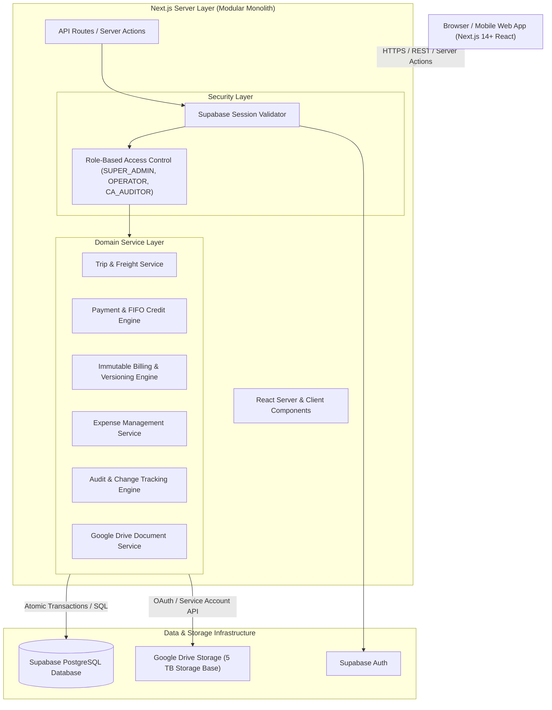
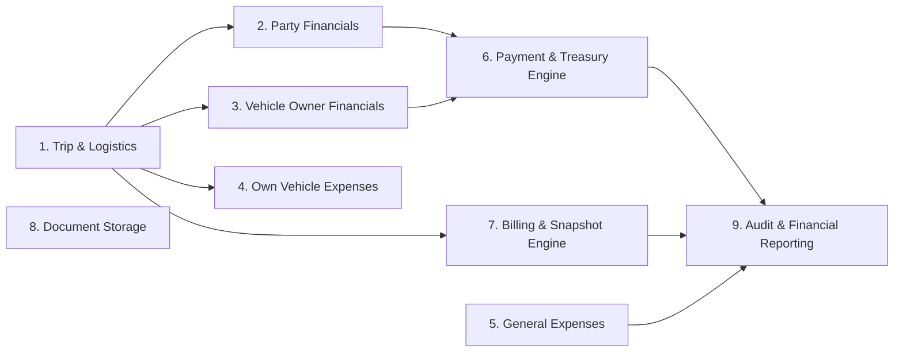

# Shri Sanwariya Road Lines (SSRL) ERP — Master System Architecture & Technical Design Specification

**Document Version:** 1.0.0  
**Author:** Principal Software Architect & Senior Full-Stack Engineering Agent  
**Target System:** Production-Grade Web ERP for Shri Sanwariya Road Lines  
**System Status:** Authoritative Technical Specification  

---

## Executive Summary

This document specifies the complete system architecture, domain model, financial ledger engine, database schema, security model, and implementation roadmap for the **Shri Sanwariya Road Lines (SSRL)** Web ERP application. 

The application is engineered as a high-integrity, audit-compliant financial and operational ERP system managing market and own-fleet freight logistics across India. **Financial correctness and absolute transaction immutability take priority over convenience.**

---

## A. System Architecture

The SSRL ERP is structured as a **Modular Monolith** built on a Next.js (App Router) frontend/backend foundation with Supabase PostgreSQL as the primary system of record, Supabase Auth for identity management, and Google Drive API for document storage.



### Architectural Principles
1. **Separation of Concerns**: Business rules and financial math reside exclusively in server-side domain services (`/lib/domain/*`), isolated from UI components.
2. **Atomic Financial Transactions**: All payment allocations, credit updates, reversals, and billing snapshot operations execute within strict PostgreSQL transaction blocks (`BEGIN...COMMIT`).
3. **Immutability First**: Financial transactions, payment records, and generated bills are never physically deleted. Updates create reversal records or increment version counters.
4. **Stateless App Server**: Next.js server instance is completely stateless, relying on Supabase for data & sessions and Google Drive for document blobs.

---

## B. Domain Boundaries

The application is partitioned into 9 clean domain boundaries:



1. **Trip & Logistics Domain**: Manages vehicles, drivers, parties, vehicle owners, loading details, single/multi-destination drops, LR numbers, and trip execution status.
2. **Party Financials Domain**: Calculates Party Freight, unloading charges, detention, additional charges, optional TDS, and deductions to derive net Party Receivables.
3. **Vehicle Owner Financials Domain**: Calculates Vehicle Owner Freight, detention, additional charges, and multi-deductions (deducted **only** from Freight) to derive net Vehicle Owner Payables.
4. **Own Vehicle Expenses Domain**: Tracks trip-linked expenses for SSRL-owned fleet (Bhatta, Diesel, Fastag, Maintenance, Repair with reason, Driver Salary, Other with remark).
5. **General Expenses Domain**: Handles non-trip operational expenses with soft-deletion and restoration capability.
6. **Payment & Treasury Engine**: Processes Party Advances/Balances/Detention, Vehicle Owner Advances/Balances/Detention, and Party Bulk Payments using a FIFO (Oldest First) debt allocation algorithm with Party Credit generation and reversal cascading.
7. **Billing & Snapshot Engine**: Generates immutable, versioned bill snapshots (`v1`, `v2`, `v3`) with automated outdated detection upon trip modifications, and Super-Admin cancellation/restoration capability.
8. **Document Storage Domain**: Securely uploads and links bill PDFs, LRs, weight slips, and receipts to Google Drive with Supabase metadata tracking and proxy authentication.
9. **Audit & Financial Reporting Domain**: Logs every financial mutation (OLD → NEW diffs, user ID, timestamp, reason) and powers role-specific dashboards, including a dedicated CA/Auditor accounting view.

---

## C. Complete Entity Model

### Core Entities & Key Fields

1. **User & Profile (`users`)**: `id` (UUID, FK to auth.users), `email`, `full_name`, `role` (ENUM: `SUPER_ADMIN`, `OPERATOR`, `CA_AUDITOR`), `is_active`, `created_at`.
2. **Party (`parties`)**: `id`, `name`, `gstin`, `phone`, `email`, `address`, `created_at`, `updated_at`.
3. **Vehicle Owner (`vehicle_owners`)**: `id`, `name`, `phone`, `pan_number`, `bank_details` (JSONB), `address`, `created_at`.
4. **Vehicle (`vehicles`)**: `id`, `vehicle_number`, `ownership_type` (ENUM: `MARKET`, `OWN`), `vehicle_type`, `owner_id` (FK optional), `created_at`.
5. **Driver (`drivers`)**: `id`, `name`, `phone`, `license_number`, `created_at`.
6. **Trip (`trips`)**: `id`, `trip_number` (Unique string), `party_id` (FK), `vehicle_id` (FK), `vehicle_owner_id` (FK optional), `driver_id` (FK optional), `loading_date` (Date), `loading_location` (String), `lr_number` (String optional), `invoice_number` (String optional), `trip_status` (ENUM: `PLANNED`, `IN_TRANSIT`, `DELIVERED`, `SETTLED`, `CANCELLED`), `is_deleted` (Boolean, soft delete), `remarks`, `created_at`, `updated_at`.
7. **Trip Destination (`trip_destinations`)**: `id`, `trip_id` (FK), `sequence_order` (Int), `destination_name` (String), `unloading_charge` (Decimal), `remarks`.
8. **Trip Party Financial (`trip_party_financials`)**: `id`, `trip_id` (FK, Unique), `freight` (Decimal), `detention` (Decimal), `additional_charges` (Decimal), `deductions` (Decimal), `tds_applicable` (Boolean), `tds_amount` (Decimal), `net_receivable` (Decimal), `remarks`.
9. **Trip Owner Financial (`trip_owner_financials`)**: `id`, `trip_id` (FK, Unique), `freight` (Decimal), `detention` (Decimal), `additional_charges` (Decimal), `unloading_charges` (Decimal), `net_payable` (Decimal), `remarks`.
10. **Vehicle Owner Deduction (`vehicle_owner_deductions`)**: `id`, `trip_owner_financial_id` (FK), `amount` (Decimal), `reason` (Text), `created_by` (FK User), `created_at`.
11. **Own Vehicle Expense (`own_vehicle_expenses`)**: `id`, `trip_id` (FK optional), `vehicle_id` (FK), `driver_id` (FK optional), `expense_type` (ENUM: `BHATTA`, `DIESEL`, `FASTAG`, `DRIVER_SALARY`, `MAINTENANCE`, `REPAIR`, `OTHER`), `amount` (Decimal), `expense_date` (Date), `reason_or_remark` (Text), `created_by` (FK User), `created_at`.
12. **General Expense (`general_expenses`)**: `id`, `category` (String), `amount` (Decimal), `expense_date` (Date), `reason_or_remark` (Text), `is_deleted` (Boolean), `deleted_at`, `deleted_by`, `created_by` (FK User), `created_at`.
13. **Payment (`payments`)**: `id`, `payment_number` (Unique), `payment_type` (ENUM: `PARTY_ADVANCE`, `PARTY_BALANCE`, `PARTY_DETENTION`, `VEHICLE_OWNER_ADVANCE`, `VEHICLE_OWNER_BALANCE`, `VEHICLE_OWNER_DETENTION`, `BULK_PAYMENT`), `party_id` (FK optional), `vehicle_owner_id` (FK optional), `trip_id` (FK optional), `amount` (Decimal), `payment_mode` (ENUM: `UPI`, `CASH`, `BANK_TRANSFER`, `CHEQUE`), `reference_number` (String), `payment_date` (Date), `status` (ENUM: `ACTIVE`, `CANCELLED`), `cancelled_at`, `cancelled_by`, `cancellation_reason`, `created_by` (FK User), `created_at`.
14. **Payment Reversal (`payment_reversals`)**: `id`, `original_payment_id` (FK, Unique), `reversal_amount` (Decimal), `reversal_date` (Timestamp), `performed_by` (FK User), `reason` (Text).
15. **Party Credit Ledger (`party_credits`)**: `id`, `party_id` (FK), `source_payment_id` (FK), `original_credit` (Decimal), `amount_used` (Decimal), `remaining_credit` (Decimal), `status` (ENUM: `ACTIVE`, `EXHAUSTED`, `REVERSED`), `created_at`.
16. **Party Credit Usage (`party_credit_usages`)**: `id`, `party_credit_id` (FK), `target_trip_id` (FK), `amount_applied` (Decimal), `applied_at` (Timestamp), `reversed` (Boolean).
17. **Bill (`bills`)**: `id`, `bill_number` (Unique string, e.g. `INV-2026-001`), `party_id` (FK), `current_version` (Int), `status` (ENUM: `CURRENT`, `OUTDATED`, `CANCELLED`, `RESTORED`, `TRIP_DELETED`), `previous_status_before_trip_deleted` (String optional), `cancelled_at`, `cancelled_by`, `cancellation_reason`, `created_at`.
18. **Bill Version Snapshot (`bill_versions`)**: `id`, `bill_id` (FK), `version_number` (Int), `snapshot_data` (JSONB, frozen trip & financial breakdown), `generated_by` (FK User), `generated_at`.
19. **Bill Trip Mapping (`bill_trips`)**: `id`, `bill_id` (FK), `trip_id` (FK).
20. **Submission (`submissions`)**: `id`, `submission_number` (Unique), `submission_date` (Date), `remarks`, `is_deleted` (Boolean), `created_by`, `created_at`.
21. **Submission Bill Mapping (`submission_bills`)**: `id`, `submission_id` (FK), `bill_id` (FK).
22. **Audit Log (`audit_logs`)**: `id`, `entity_type` (String), `entity_id` (UUID), `action` (ENUM: `CREATE`, `UPDATE`, `DELETE`, `RESTORE`, `CANCEL`, `REVERSE`), `old_values` (JSONB), `new_values` (JSONB), `change_reason` (Text), `performed_by` (FK User), `performed_at`.
23. **Document Metadata (`document_metadata`)**: `id`, `entity_type` (ENUM: `TRIP`, `BILL`, `PAYMENT`, `EXPENSE`), `entity_id` (UUID), `document_type` (ENUM: `LR`, `WEIGHT_SLIP`, `BILL_PDF`, `RECEIPT`, `OTHER`), `drive_file_id` (String), `file_name` (String), `mime_type` (String), `file_size` (BigInt), `uploaded_by` (FK User), `created_at`.

---

## D. Database Schema Proposal (PostgreSQL DDL)

```sql
-- Enable UUID extension
CREATE EXTENSION IF NOT EXISTS "uuid-ossp";

-- Role Types
CREATE TYPE user_role AS ENUM ('SUPER_ADMIN', 'OPERATOR', 'CA_AUDITOR');
CREATE TYPE vehicle_ownership AS ENUM ('MARKET', 'OWN');
CREATE TYPE trip_status_type AS ENUM ('PLANNED', 'IN_TRANSIT', 'DELIVERED', 'SETTLED', 'CANCELLED');
CREATE TYPE own_expense_category AS ENUM ('BHATTA', 'DIESEL', 'FASTAG', 'DRIVER_SALARY', 'MAINTENANCE', 'REPAIR', 'OTHER');
CREATE TYPE payment_type_enum AS ENUM (
  'PARTY_ADVANCE', 'PARTY_BALANCE', 'PARTY_DETENTION',
  'VEHICLE_OWNER_ADVANCE', 'VEHICLE_OWNER_BALANCE', 'VEHICLE_OWNER_DETENTION',
  'BULK_PAYMENT'
);
CREATE TYPE payment_mode_enum AS ENUM ('UPI', 'CASH', 'BANK_TRANSFER', 'CHEQUE');
CREATE TYPE payment_status_enum AS ENUM ('ACTIVE', 'CANCELLED');
CREATE TYPE credit_status_enum AS ENUM ('ACTIVE', 'EXHAUSTED', 'REVERSED');
CREATE TYPE bill_status_enum AS ENUM ('CURRENT', 'OUTDATED', 'CANCELLED', 'RESTORED', 'TRIP_DELETED');

-- Users & Profiles
CREATE TABLE profiles (
  id UUID PRIMARY KEY REFERENCES auth.users(id) ON DELETE CASCADE,
  email TEXT NOT NULL UNIQUE,
  full_name TEXT NOT NULL,
  role user_role NOT NULL DEFAULT 'OPERATOR',
  is_active BOOLEAN NOT NULL DEFAULT TRUE,
  created_at TIMESTAMPTZ NOT NULL DEFAULT NOW()
);

-- Parties
CREATE TABLE parties (
  id UUID PRIMARY KEY DEFAULT uuid_generate_v4(),
  name TEXT NOT NULL UNIQUE,
  gstin TEXT,
  phone TEXT,
  email TEXT,
  address TEXT,
  created_at TIMESTAMPTZ NOT NULL DEFAULT NOW(),
  updated_at TIMESTAMPTZ NOT NULL DEFAULT NOW()
);

-- Vehicle Owners
CREATE TABLE vehicle_owners (
  id UUID PRIMARY KEY DEFAULT uuid_generate_v4(),
  name TEXT NOT NULL,
  phone TEXT,
  pan_number TEXT,
  bank_details JSONB DEFAULT '{}'::jsonb,
  address TEXT,
  created_at TIMESTAMPTZ NOT NULL DEFAULT NOW()
);

-- Vehicles
CREATE TABLE vehicles (
  id UUID PRIMARY KEY DEFAULT uuid_generate_v4(),
  vehicle_number TEXT NOT NULL UNIQUE,
  ownership_type vehicle_ownership NOT NULL,
  owner_id UUID REFERENCES vehicle_owners(id) ON DELETE SET NULL,
  created_at TIMESTAMPTZ NOT NULL DEFAULT NOW()
);

-- Drivers
CREATE TABLE drivers (
  id UUID PRIMARY KEY DEFAULT uuid_generate_v4(),
  name TEXT NOT NULL,
  phone TEXT,
  license_number TEXT,
  created_at TIMESTAMPTZ NOT NULL DEFAULT NOW()
);

-- Trips
CREATE TABLE trips (
  id UUID PRIMARY KEY DEFAULT uuid_generate_v4(),
  trip_number TEXT NOT NULL UNIQUE,
  party_id UUID NOT NULL REFERENCES parties(id),
  vehicle_id UUID NOT NULL REFERENCES vehicles(id),
  vehicle_owner_id UUID REFERENCES vehicle_owners(id),
  driver_id UUID REFERENCES drivers(id),
  loading_date DATE NOT NULL,
  loading_location TEXT NOT NULL,
  lr_number TEXT,
  invoice_number TEXT,
  trip_status trip_status_type NOT NULL DEFAULT 'IN_TRANSIT',
  is_deleted BOOLEAN NOT NULL DEFAULT FALSE,
  remarks TEXT,
  created_at TIMESTAMPTZ NOT NULL DEFAULT NOW(),
  updated_at TIMESTAMPTZ NOT NULL DEFAULT NOW()
);

-- Trip Destinations
CREATE TABLE trip_destinations (
  id UUID PRIMARY KEY DEFAULT uuid_generate_v4(),
  trip_id UUID NOT NULL REFERENCES trips(id) ON DELETE CASCADE,
  sequence_order INT NOT NULL DEFAULT 1,
  destination_name TEXT NOT NULL,
  unloading_charge NUMERIC(12,2) NOT NULL DEFAULT 0.00 CHECK (unloading_charge >= 0),
  remarks TEXT
);

-- Trip Party Financials
CREATE TABLE trip_party_financials (
  id UUID PRIMARY KEY DEFAULT uuid_generate_v4(),
  trip_id UUID NOT NULL UNIQUE REFERENCES trips(id) ON DELETE CASCADE,
  freight NUMERIC(12,2) NOT NULL CHECK (freight >= 0),
  detention NUMERIC(12,2) NOT NULL DEFAULT 0.00 CHECK (detention >= 0),
  additional_charges NUMERIC(12,2) NOT NULL DEFAULT 0.00 CHECK (additional_charges >= 0),
  deductions NUMERIC(12,2) NOT NULL DEFAULT 0.00 CHECK (deductions >= 0),
  tds_applicable BOOLEAN NOT NULL DEFAULT FALSE,
  tds_amount NUMERIC(12,2) NOT NULL DEFAULT 0.00 CHECK (tds_amount >= 0),
  net_receivable NUMERIC(12,2) NOT NULL GENERATED ALWAYS AS (
    freight + detention + additional_charges - deductions - tds_amount
  ) STORED,
  remarks TEXT
);

-- Trip Owner Financials
CREATE TABLE trip_owner_financials (
  id UUID PRIMARY KEY DEFAULT uuid_generate_v4(),
  trip_id UUID NOT NULL UNIQUE REFERENCES trips(id) ON DELETE CASCADE,
  freight NUMERIC(12,2) NOT NULL CHECK (freight >= 0),
  detention NUMERIC(12,2) NOT NULL DEFAULT 0.00 CHECK (detention >= 0),
  additional_charges NUMERIC(12,2) NOT NULL DEFAULT 0.00 CHECK (additional_charges >= 0),
  unloading_charges NUMERIC(12,2) NOT NULL DEFAULT 0.00 CHECK (unloading_charges >= 0),
  total_deductions NUMERIC(12,2) NOT NULL DEFAULT 0.00 CHECK (total_deductions >= 0),
  net_payable NUMERIC(12,2) NOT NULL GENERATED ALWAYS AS (
    (freight - total_deductions) + detention + additional_charges + unloading_charges
  ) STORED,
  remarks TEXT,
  CONSTRAINT chk_deductions_lte_freight CHECK (total_deductions <= freight)
);

-- Vehicle Owner Deductions (Historical & Multi-entry)
CREATE TABLE vehicle_owner_deductions (
  id UUID PRIMARY KEY DEFAULT uuid_generate_v4(),
  trip_owner_financial_id UUID NOT NULL REFERENCES trip_owner_financials(id) ON DELETE CASCADE,
  amount NUMERIC(12,2) NOT NULL CHECK (amount > 0),
  reason TEXT NOT NULL,
  created_by UUID NOT NULL REFERENCES profiles(id),
  created_at TIMESTAMPTZ NOT NULL DEFAULT NOW()
);

-- Own Vehicle Expenses
CREATE TABLE own_vehicle_expenses (
  id UUID PRIMARY KEY DEFAULT uuid_generate_v4(),
  trip_id UUID REFERENCES trips(id) ON DELETE SET NULL,
  vehicle_id UUID NOT NULL REFERENCES vehicles(id),
  driver_id UUID REFERENCES drivers(id),
  expense_type own_expense_category NOT NULL,
  amount NUMERIC(12,2) NOT NULL CHECK (amount > 0),
  expense_date DATE NOT NULL DEFAULT CURRENT_DATE,
  reason_or_remark TEXT NOT NULL,
  created_by UUID NOT NULL REFERENCES profiles(id),
  created_at TIMESTAMPTZ NOT NULL DEFAULT NOW()
);

-- General Expenses
CREATE TABLE general_expenses (
  id UUID PRIMARY KEY DEFAULT uuid_generate_v4(),
  category TEXT NOT NULL,
  amount NUMERIC(12,2) NOT NULL CHECK (amount > 0),
  expense_date DATE NOT NULL DEFAULT CURRENT_DATE,
  reason_or_remark TEXT,
  is_deleted BOOLEAN NOT NULL DEFAULT FALSE,
  deleted_at TIMESTAMPTZ,
  deleted_by UUID REFERENCES profiles(id),
  created_by UUID NOT NULL REFERENCES profiles(id),
  created_at TIMESTAMPTZ NOT NULL DEFAULT NOW()
);

-- Payments
CREATE TABLE payments (
  id UUID PRIMARY KEY DEFAULT uuid_generate_v4(),
  payment_number TEXT NOT NULL UNIQUE,
  payment_type payment_type_enum NOT NULL,
  party_id UUID REFERENCES parties(id),
  vehicle_owner_id UUID REFERENCES vehicle_owners(id),
  trip_id UUID REFERENCES trips(id),
  amount NUMERIC(12,2) NOT NULL CHECK (amount > 0),
  payment_mode payment_mode_enum NOT NULL DEFAULT 'UPI',
  reference_number TEXT,
  payment_date DATE NOT NULL DEFAULT CURRENT_DATE,
  status payment_status_enum NOT NULL DEFAULT 'ACTIVE',
  cancelled_at TIMESTAMPTZ,
  cancelled_by UUID REFERENCES profiles(id),
  cancellation_reason TEXT,
  created_by UUID NOT NULL REFERENCES profiles(id),
  created_at TIMESTAMPTZ NOT NULL DEFAULT NOW()
);

-- Payment Reversals
CREATE TABLE payment_reversals (
  id UUID PRIMARY KEY DEFAULT uuid_generate_v4(),
  original_payment_id UUID NOT NULL UNIQUE REFERENCES payments(id),
  reversal_amount NUMERIC(12,2) NOT NULL,
  reversal_date TIMESTAMPTZ NOT NULL DEFAULT NOW(),
  performed_by UUID NOT NULL REFERENCES profiles(id),
  reason TEXT NOT NULL
);

-- Party Credit Ledger
CREATE TABLE party_credits (
  id UUID PRIMARY KEY DEFAULT uuid_generate_v4(),
  party_id UUID NOT NULL REFERENCES parties(id),
  source_payment_id UUID NOT NULL REFERENCES payments(id),
  original_credit NUMERIC(12,2) NOT NULL CHECK (original_credit > 0),
  amount_used NUMERIC(12,2) NOT NULL DEFAULT 0.00 CHECK (amount_used >= 0),
  remaining_credit NUMERIC(12,2) NOT NULL GENERATED ALWAYS AS (original_credit - amount_used) STORED,
  status credit_status_enum NOT NULL DEFAULT 'ACTIVE',
  created_at TIMESTAMPTZ NOT NULL DEFAULT NOW()
);

-- Party Credit Usage Track
CREATE TABLE party_credit_usages (
  id UUID PRIMARY KEY DEFAULT uuid_generate_v4(),
  party_credit_id UUID NOT NULL REFERENCES party_credits(id),
  target_trip_id UUID NOT NULL REFERENCES trips(id),
  amount_applied NUMERIC(12,2) NOT NULL CHECK (amount_applied > 0),
  applied_at TIMESTAMPTZ NOT NULL DEFAULT NOW(),
  reversed BOOLEAN NOT NULL DEFAULT FALSE
);

-- Bills
CREATE TABLE bills (
  id UUID PRIMARY KEY DEFAULT uuid_generate_v4(),
  bill_number TEXT NOT NULL UNIQUE,
  party_id UUID NOT NULL REFERENCES parties(id),
  current_version INT NOT NULL DEFAULT 1,
  status bill_status_enum NOT NULL DEFAULT 'CURRENT',
  previous_status_before_trip_deleted TEXT,
  cancelled_at TIMESTAMPTZ,
  cancelled_by UUID REFERENCES profiles(id),
  cancellation_reason TEXT,
  created_at TIMESTAMPTZ NOT NULL DEFAULT NOW()
);

-- Bill Version Snapshots
CREATE TABLE bill_versions (
  id UUID PRIMARY KEY DEFAULT uuid_generate_v4(),
  bill_id UUID NOT NULL REFERENCES bills(id) ON DELETE CASCADE,
  version_number INT NOT NULL,
  snapshot_data JSONB NOT NULL,
  generated_by UUID NOT NULL REFERENCES profiles(id),
  generated_at TIMESTAMPTZ NOT NULL DEFAULT NOW(),
  UNIQUE(bill_id, version_number)
);

-- Bill Trips
CREATE TABLE bill_trips (
  id UUID PRIMARY KEY DEFAULT uuid_generate_v4(),
  bill_id UUID NOT NULL REFERENCES bills(id) ON DELETE CASCADE,
  trip_id UUID NOT NULL REFERENCES trips(id)
);

-- Submissions
CREATE TABLE submissions (
  id UUID PRIMARY KEY DEFAULT uuid_generate_v4(),
  submission_number TEXT NOT NULL UNIQUE,
  submission_date DATE NOT NULL DEFAULT CURRENT_DATE,
  remarks TEXT,
  is_deleted BOOLEAN NOT NULL DEFAULT FALSE,
  created_by UUID NOT NULL REFERENCES profiles(id),
  created_at TIMESTAMPTZ NOT NULL DEFAULT NOW()
);

-- Submission Bills
CREATE TABLE submission_bills (
  id UUID PRIMARY KEY DEFAULT uuid_generate_v4(),
  submission_id UUID NOT NULL REFERENCES submissions(id) ON DELETE CASCADE,
  bill_id UUID NOT NULL REFERENCES bills(id)
);

-- Audit Logs
CREATE TABLE audit_logs (
  id UUID PRIMARY KEY DEFAULT uuid_generate_v4(),
  entity_type TEXT NOT NULL,
  entity_id UUID NOT NULL,
  action TEXT NOT NULL,
  old_values JSONB,
  new_values JSONB,
  change_reason TEXT,
  performed_by UUID NOT NULL REFERENCES profiles(id),
  performed_at TIMESTAMPTZ NOT NULL DEFAULT NOW()
);

-- Document Metadata
CREATE TABLE document_metadata (
  id UUID PRIMARY KEY DEFAULT uuid_generate_v4(),
  entity_type TEXT NOT NULL,
  entity_id UUID NOT NULL,
  document_type TEXT NOT NULL,
  drive_file_id TEXT NOT NULL,
  file_name TEXT NOT NULL,
  mime_type TEXT NOT NULL,
  file_size BIGINT NOT NULL,
  uploaded_by UUID NOT NULL REFERENCES profiles(id),
  created_at TIMESTAMPTZ NOT NULL DEFAULT NOW()
);

-- Indexes for Speed & Performance
CREATE INDEX idx_trips_party ON trips(party_id);
CREATE INDEX idx_trips_vehicle ON trips(vehicle_id);
CREATE INDEX idx_trips_owner ON trips(vehicle_owner_id);
CREATE INDEX idx_payments_party ON payments(party_id);
CREATE INDEX idx_payments_owner ON payments(vehicle_owner_id);
CREATE INDEX idx_payments_trip ON payments(trip_id);
CREATE INDEX idx_audit_entity ON audit_logs(entity_type, entity_id);
CREATE INDEX idx_bills_party ON bills(party_id);
