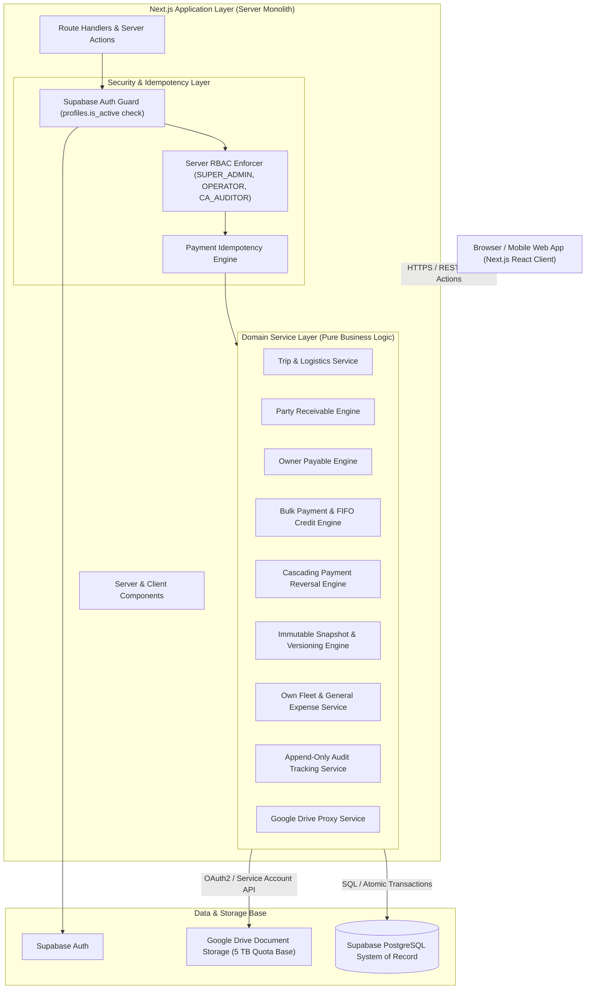
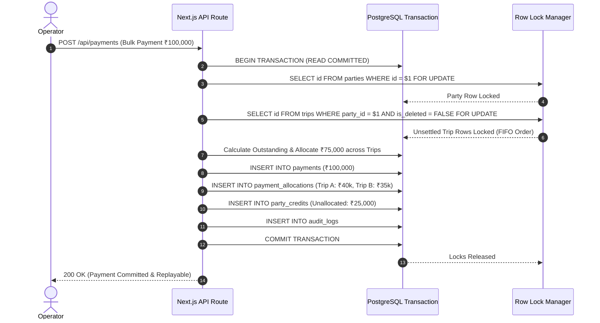

# Shri Sanwariya Road Lines (SSRL) ERP  
## Master Architecture & Technical Design Specification v1.2  
### Final Authoritative Specification & Implementation Blueprint

**Document Version:** 1.2.0 (Final Architecture Freeze)  
**Status:** ARCHITECTURE STATUS: READY FOR IMPLEMENTATION  
**Author:** Principal Software Architect & Senior Full-Stack Engineering Agent  

---

## 1. FINAL ARCHITECTURE v1.2

The SSRL ERP is engineered as a **Modular Monolith** built on Next.js 14+ (App Router, React, TypeScript), Vanilla/Custom CSS, Supabase PostgreSQL, Supabase Auth, and Google Drive API.



### Architectural Guarantees:
1. **Financial Isolation**: Business rules and math exist exclusively inside `/lib/domain/*`. React UI components NEVER perform financial calculations.
2. **ACID Transaction Boundaries**: Every financial mutation (payments, FIFO allocations, reversals, bill snapshots, trip edits) runs inside strict PostgreSQL transaction blocks (`BEGIN...COMMIT`).
3. **Pessimistic Locking**: Concurrent payment and allocation requests lock database rows using `FOR UPDATE` to guarantee zero double-allocation or overpayment.
4. **Append-Only Immutability**: Financial ledger records, payment allocations, credit applications, and audit logs are never physically deleted. Reversals write compensating entries.

---

## 2. FINAL BUSINESS RULES (BR-001 THROUGH BR-012)

### BR-001 — Party Freight Reduction After Payment
* **FINAL DECISION**: `OPTION A`.
* If a financial edit results in `New Net Receivable < (Active Payment Allocations + Active Credit Applied)`, the edit MUST be REJECTED.
* The system will NOT automatically create Party Credit or generate implicit adjustment transactions.
* **Workflow**: The user must first reverse/reallocate existing payments through the payment reversal workflow before reducing trip freight.
* **Exception**: A `SUPER_ADMIN` may execute the payment reversal workflow first, then modify the trip freight.

### BR-002 — Vehicle Owner Payable Reduction After Payment
* **FINAL DECISION**: `OPTION A`.
* If a financial edit results in `New Net Payable < Active Vehicle Owner Payments`, the edit MUST be REJECTED.
* V1 contains NO Vehicle Owner Credit system and NO Vehicle Owner Recovery ledger.
* **Workflow**: Owner payments must be reversed via the authorized reversal workflow before owner payables can be reduced.

### BR-003 — Destination Unloading Charges
* **FINAL DECISION**: `OPTION A`.
* Destination unloading charges are part of the Party Receivable:
  $$\text{Party Net Receivable} = \text{Freight} + \text{Unloading Charges} + \text{Detention} + \text{Additional Charges} - \text{Deductions} - \text{TDS}$$
* Destination unloading charges (`trip_destinations.unloading_charge`) are aggregated atomically into `trip_party_financials.unloading_charges` inside the database transaction whenever destinations are created, edited, or deleted.
* Immutable Bill snapshots store both itemized drop charges and the aggregated total.

### BR-004 — Tax Deducted at Source (TDS)
* **FINAL DECISION**: `OPTION D`.
* TDS is manually entered based on actual TDS certificates. Automatic TDS calculation is prohibited in V1.
* The user marks TDS as applicable and enters `tds_amount`.
* **Validation**: $0 \le \text{tds\_amount} \le \text{Gross Party Receivable}$ (where $\text{Gross Receivable} = \text{Freight} + \text{Unloading} + \text{Detention} + \text{Additional Charges}$).
* `tds_amount` is subtracted from Party Net Receivable and preserved in bill snapshots and audit logs.

### BR-005 — Backdated Payments
* **FINAL DECISION**: `OPTION C`.
* `OPERATOR` users may enter `payment_date` up to 30 calendar days in the past (mandatory reason required).
* `SUPER_ADMIN` users may enter `payment_date` with unrestricted past dates (mandatory reason required).
* Future-dated payments (`payment_date > CURRENT_DATE`) are strictly prohibited.
* Payments preserve separate fields: `payment_date` (accounting period date), `created_at` (system entry timestamp), and `created_by` (user ID).
* Accounting reports filter by `payment_date`; audit trails log `created_at`.

### BR-006 — Soft-Deleted Trip Restoration
* **FINAL DECISION**: `OPTION B`.
* A soft-deleted Trip may be restored by `SUPER_ADMIN` ONLY if the Trip belongs to the currently active Financial Year (April 1 to March 31 in India).
* Trips belonging to closed Financial Years CANNOT be restored.
* Restoration generates an audit log entry and restores linked Bill statuses based on `previous_status_before_trip_deleted`.

### BR-007 — Party Credit Lifespan
* **FINAL DECISION**: `OPTION A`.
* Party Credit carries forward indefinitely across Financial Years until fully consumed by future trips, explicitly reversed, or resolved via a future accounting refund workflow.
* Party Credit does NOT expire on March 31st and does NOT convert to revenue.

### BR-008 — Billing Before Delivery
* **FINAL DECISION**:
* A Trip may be billed ONLY when:
  `trip_status = DELIVERED`  
  OR  
  `trip_status = IN_TRANSIT AND valid POD/document confirmation exists`.
* Trips with `trip_status = PLANNED` CANNOT be billed. Server-side validation enforces this constraint.

### BR-009 — Vehicle Owner Payments Before Delivery
* **FINAL DECISION**:
* **Vehicle Owner Advance**: Permitted anytime (including `PLANNED` or `IN_TRANSIT`).
* **Vehicle Owner Balance**: Requires `trip_status = DELIVERED`.
* **Vehicle Owner Detention**: Requires detention amount to be explicitly recorded and confirmed.
* All owner payments remain strictly enforced under the Overpayment Prevention Rule ($\sum \text{Payments} \le \text{Net Payable}$).

### BR-010 — Automatic Settlement
* **FINAL DECISION**:
* Trip Settlement is automatic inside the database transaction when:
  $$\text{Party Outstanding} = 0 \quad \text{AND} \quad \text{Vehicle Owner Outstanding} = 0 \quad (\text{for MARKET vehicles})$$
* For `OWN` vehicles, the Vehicle Owner payable condition does not apply ($\text{Party Outstanding} = 0$).
* A trip MUST NOT settle if only one side has been paid.

### BR-011 — Financial Editing After Settlement
* **FINAL DECISION**:
* Normal users (`OPERATOR`) CANNOT modify financial values of a `SETTLED` Trip.
* `SUPER_ADMIN` may modify settled trip financials ONLY through a controlled adjustment workflow:
  1. Trip status temporarily reverts to `DELIVERED`.
  2. BR-001 and BR-002 payment validations are evaluated.
  3. If new receivable/payable is less than payments made, edit is REJECTED until payments are reversed.
  4. Mandatory change reason is logged with OLD $\rightarrow$ NEW diffs.
  5. Settlement engine recalculates status post-edit.

### BR-012 — Payment Reversals
* **FINAL DECISION**:
* V1 supports **FULL payment reversal ONLY**. Partial payment reversals are prohibited.
* Payments are either `ACTIVE` or `CANCELLED`.
* Reversing a Bulk Payment unwinds `payment_allocations`, `party_credits`, and `party_credit_usages` atomically. No historical rows are hard-deleted.

---

## 3. FINAL DATABASE MODEL (COMPLETE POSTGRESQL DDL)

```sql
-- Enable UUID Extension
CREATE EXTENSION IF NOT EXISTS "uuid-ossp";

-- Role Types
CREATE TYPE user_role AS ENUM ('SUPER_ADMIN', 'OPERATOR', 'CA_AUDITOR');
CREATE TYPE vehicle_ownership AS ENUM ('MARKET', 'OWN');
CREATE TYPE trip_status_type AS ENUM ('PLANNED', 'IN_TRANSIT', 'DELIVERED', 'SETTLED', 'CANCELLED');
CREATE TYPE own_expense_category AS ENUM ('BHATTA', 'DIESEL', 'FASTAG', 'DRIVER_SALARY', 'MAINTENANCE', 'REPAIR', 'OTHER');
CREATE TYPE payment_type_enum AS ENUM (
  'PARTY_ADVANCE', 'PARTY_BALANCE', 'PARTY_DETENTION',
  'VEHICLE_OWNER_ADVANCE', 'VEHICLE_OWNER_BALANCE', 'VEHICLE_OWNER_DETENTION',
  'BULK_PAYMENT'
);
CREATE TYPE payment_mode_enum AS ENUM ('UPI', 'CASH', 'BANK_TRANSFER', 'CHEQUE');
CREATE TYPE payment_status_enum AS ENUM ('ACTIVE', 'CANCELLED');
CREATE TYPE allocation_status_enum AS ENUM ('ACTIVE', 'REVERSED');
CREATE TYPE credit_status_enum AS ENUM ('ACTIVE', 'EXHAUSTED', 'REVERSED');
CREATE TYPE bill_status_enum AS ENUM ('CURRENT', 'OUTDATED', 'CANCELLED', 'RESTORED', 'TRIP_DELETED');

-- Users & Profiles
CREATE TABLE profiles (
  id UUID PRIMARY KEY REFERENCES auth.users(id) ON DELETE RESTRICT,
  email TEXT NOT NULL UNIQUE,
  full_name TEXT NOT NULL,
  role user_role NOT NULL DEFAULT 'OPERATOR',
  is_active BOOLEAN NOT NULL DEFAULT TRUE,
  created_at TIMESTAMPTZ NOT NULL DEFAULT NOW()
);

-- Parties
CREATE TABLE parties (
  id UUID PRIMARY KEY DEFAULT uuid_generate_v4(),
  name TEXT NOT NULL UNIQUE,
  gstin TEXT,
  phone TEXT,
  email TEXT,
  address TEXT,
  created_at TIMESTAMPTZ NOT NULL DEFAULT NOW(),
  updated_at TIMESTAMPTZ NOT NULL DEFAULT NOW()
);

-- Vehicle Owners
CREATE TABLE vehicle_owners (
  id UUID PRIMARY KEY DEFAULT uuid_generate_v4(),
  name TEXT NOT NULL,
  phone TEXT,
  pan_number TEXT,
  bank_details JSONB DEFAULT '{}'::jsonb,
  address TEXT,
  created_at TIMESTAMPTZ NOT NULL DEFAULT NOW()
);

-- Vehicles
CREATE TABLE vehicles (
  id UUID PRIMARY KEY DEFAULT uuid_generate_v4(),
  vehicle_number TEXT NOT NULL UNIQUE,
  ownership_type vehicle_ownership NOT NULL,
  owner_id UUID REFERENCES vehicle_owners(id) ON DELETE SET NULL,
  created_at TIMESTAMPTZ NOT NULL DEFAULT NOW()
);

-- Drivers
CREATE TABLE drivers (
  id UUID PRIMARY KEY DEFAULT uuid_generate_v4(),
  name TEXT NOT NULL,
  phone TEXT,
  license_number TEXT,
  created_at TIMESTAMPTZ NOT NULL DEFAULT NOW()
);

-- Trips
CREATE TABLE trips (
  id UUID PRIMARY KEY DEFAULT uuid_generate_v4(),
  trip_number TEXT NOT NULL UNIQUE,
  party_id UUID NOT NULL REFERENCES parties(id) ON DELETE RESTRICT,
  vehicle_id UUID NOT NULL REFERENCES vehicles(id) ON DELETE RESTRICT,
  vehicle_owner_id UUID REFERENCES vehicle_owners(id) ON DELETE RESTRICT,
  driver_id UUID REFERENCES drivers(id) ON DELETE RESTRICT,
  loading_date DATE NOT NULL,
  loading_location TEXT NOT NULL,
  lr_number TEXT,
  invoice_number TEXT,
  trip_status trip_status_type NOT NULL DEFAULT 'IN_TRANSIT',
  is_deleted BOOLEAN NOT NULL DEFAULT FALSE,
  remarks TEXT,
  created_at TIMESTAMPTZ NOT NULL DEFAULT NOW(),
  updated_at TIMESTAMPTZ NOT NULL DEFAULT NOW()
);

-- Trip Destinations
CREATE TABLE trip_destinations (
  id UUID PRIMARY KEY DEFAULT uuid_generate_v4(),
  trip_id UUID NOT NULL REFERENCES trips(id) ON DELETE CASCADE,
  sequence_order INT NOT NULL DEFAULT 1,
  destination_name TEXT NOT NULL,
  unloading_charge NUMERIC(12,2) NOT NULL DEFAULT 0.00 CHECK (unloading_charge >= 0),
  remarks TEXT
);

-- Trip Party Financials
CREATE TABLE trip_party_financials (
  id UUID PRIMARY KEY DEFAULT uuid_generate_v4(),
  trip_id UUID NOT NULL UNIQUE REFERENCES trips(id) ON DELETE CASCADE,
  freight NUMERIC(12,2) NOT NULL CHECK (freight >= 0),
  unloading_charges NUMERIC(12,2) NOT NULL DEFAULT 0.00 CHECK (unloading_charges >= 0),
  detention NUMERIC(12,2) NOT NULL DEFAULT 0.00 CHECK (detention >= 0),
  additional_charges NUMERIC(12,2) NOT NULL DEFAULT 0.00 CHECK (additional_charges >= 0),
  deductions NUMERIC(12,2) NOT NULL DEFAULT 0.00 CHECK (deductions >= 0),
  tds_applicable BOOLEAN NOT NULL DEFAULT FALSE,
  tds_amount NUMERIC(12,2) NOT NULL DEFAULT 0.00 CHECK (tds_amount >= 0),
  gross_receivable NUMERIC(12,2) NOT NULL GENERATED ALWAYS AS (
    freight + unloading_charges + detention + additional_charges
  ) STORED,
  net_receivable NUMERIC(12,2) NOT NULL GENERATED ALWAYS AS (
    freight + unloading_charges + detention + additional_charges - deductions - tds_amount
  ) STORED,
  remarks TEXT,
  CONSTRAINT chk_party_deductions_tds CHECK ((deductions + tds_amount) <= (freight + unloading_charges + detention + additional_charges))
);

-- Trip Owner Financials
CREATE TABLE trip_owner_financials (
  id UUID PRIMARY KEY DEFAULT uuid_generate_v4(),
  trip_id UUID NOT NULL UNIQUE REFERENCES trips(id) ON DELETE CASCADE,
  freight NUMERIC(12,2) NOT NULL CHECK (freight >= 0),
  detention NUMERIC(12,2) NOT NULL DEFAULT 0.00 CHECK (detention >= 0),
  additional_charges NUMERIC(12,2) NOT NULL DEFAULT 0.00 CHECK (additional_charges >= 0),
  unloading_charges NUMERIC(12,2) NOT NULL DEFAULT 0.00 CHECK (unloading_charges >= 0),
  total_deductions NUMERIC(12,2) NOT NULL DEFAULT 0.00 CHECK (total_deductions >= 0),
  net_payable NUMERIC(12,2) NOT NULL GENERATED ALWAYS AS (
    (freight - total_deductions) + detention + additional_charges + unloading_charges
  ) STORED,
  remarks TEXT,
  CONSTRAINT chk_deductions_lte_freight CHECK (total_deductions <= freight)
);

-- Vehicle Owner Deductions
CREATE TABLE vehicle_owner_deductions (
  id UUID PRIMARY KEY DEFAULT uuid_generate_v4(),
  trip_owner_financial_id UUID NOT NULL REFERENCES trip_owner_financials(id) ON DELETE CASCADE,
  amount NUMERIC(12,2) NOT NULL CHECK (amount > 0),
  reason TEXT NOT NULL,
  created_by UUID NOT NULL REFERENCES profiles(id) ON DELETE RESTRICT,
  created_at TIMESTAMPTZ NOT NULL DEFAULT NOW()
);

-- Own Vehicle Expenses
CREATE TABLE own_vehicle_expenses (
  id UUID PRIMARY KEY DEFAULT uuid_generate_v4(),
  trip_id UUID REFERENCES trips(id) ON DELETE SET NULL,
  vehicle_id UUID NOT NULL REFERENCES vehicles(id) ON DELETE RESTRICT,
  driver_id UUID REFERENCES drivers(id) ON DELETE RESTRICT,
  expense_type own_expense_category NOT NULL,
  amount NUMERIC(12,2) NOT NULL CHECK (amount > 0),
  expense_date DATE NOT NULL DEFAULT CURRENT_DATE,
  reason_or_remark TEXT NOT NULL,
  created_by UUID NOT NULL REFERENCES profiles(id) ON DELETE RESTRICT,
  created_at TIMESTAMPTZ NOT NULL DEFAULT NOW()
);

-- General Expenses
CREATE TABLE general_expenses (
  id UUID PRIMARY KEY DEFAULT uuid_generate_v4(),
  category TEXT NOT NULL,
  amount NUMERIC(12,2) NOT NULL CHECK (amount > 0),
  expense_date DATE NOT NULL DEFAULT CURRENT_DATE,
  reason_or_remark TEXT,
  is_deleted BOOLEAN NOT NULL DEFAULT FALSE,
  deleted_at TIMESTAMPTZ,
  deleted_by UUID REFERENCES profiles(id) ON DELETE RESTRICT,
  created_by UUID NOT NULL REFERENCES profiles(id) ON DELETE RESTRICT,
  created_at TIMESTAMPTZ NOT NULL DEFAULT NOW()
);

-- Payments
CREATE TABLE payments (
  id UUID PRIMARY KEY DEFAULT uuid_generate_v4(),
  payment_number TEXT NOT NULL UNIQUE,
  payment_type payment_type_enum NOT NULL,
  party_id UUID REFERENCES parties(id) ON DELETE RESTRICT,
  vehicle_owner_id UUID REFERENCES vehicle_owners(id) ON DELETE RESTRICT,
  trip_id UUID REFERENCES trips(id) ON DELETE RESTRICT,
  amount NUMERIC(12,2) NOT NULL CHECK (amount > 0),
  payment_mode payment_mode_enum NOT NULL DEFAULT 'UPI',
  reference_number TEXT,
  payment_date DATE NOT NULL DEFAULT CURRENT_DATE CHECK (payment_date <= CURRENT_DATE),
  status payment_status_enum NOT NULL DEFAULT 'ACTIVE',
  cancelled_at TIMESTAMPTZ,
  cancelled_by UUID REFERENCES profiles(id) ON DELETE RESTRICT,
  cancellation_reason TEXT,
  created_by UUID NOT NULL REFERENCES profiles(id) ON DELETE RESTRICT,
  created_at TIMESTAMPTZ NOT NULL DEFAULT NOW()
);

-- Itemized Payment Allocations Table
CREATE TABLE payment_allocations (
  id UUID PRIMARY KEY DEFAULT uuid_generate_v4(),
  payment_id UUID NOT NULL REFERENCES payments(id) ON DELETE RESTRICT,
  trip_id UUID NOT NULL REFERENCES trips(id) ON DELETE RESTRICT,
  amount_allocated NUMERIC(12,2) NOT NULL CHECK (amount_allocated > 0),
  status allocation_status_enum NOT NULL DEFAULT 'ACTIVE',
  allocated_at TIMESTAMPTZ NOT NULL DEFAULT NOW()
);

-- Payment Reversals
CREATE TABLE payment_reversals (
  id UUID PRIMARY KEY DEFAULT uuid_generate_v4(),
  original_payment_id UUID NOT NULL UNIQUE REFERENCES payments(id) ON DELETE RESTRICT,
  reversal_amount NUMERIC(12,2) NOT NULL,
  reversal_date TIMESTAMPTZ NOT NULL DEFAULT NOW(),
  performed_by UUID NOT NULL REFERENCES profiles(id) ON DELETE RESTRICT,
  reason TEXT NOT NULL
);

-- Party Credit Ledger
CREATE TABLE party_credits (
  id UUID PRIMARY KEY DEFAULT uuid_generate_v4(),
  party_id UUID NOT NULL REFERENCES parties(id) ON DELETE RESTRICT,
  source_payment_id UUID NOT NULL REFERENCES payments(id) ON DELETE RESTRICT,
  original_credit NUMERIC(12,2) NOT NULL CHECK (original_credit > 0),
  amount_used NUMERIC(12,2) NOT NULL DEFAULT 0.00 CHECK (amount_used >= 0),
  remaining_credit NUMERIC(12,2) NOT NULL GENERATED ALWAYS AS (original_credit - amount_used) STORED,
  status credit_status_enum NOT NULL DEFAULT 'ACTIVE',
  created_at TIMESTAMPTZ NOT NULL DEFAULT NOW()
);

-- Party Credit Usage Track
CREATE TABLE party_credit_usages (
  id UUID PRIMARY KEY DEFAULT uuid_generate_v4(),
  party_credit_id UUID NOT NULL REFERENCES party_credits(id) ON DELETE RESTRICT,
  target_trip_id UUID NOT NULL REFERENCES trips(id) ON DELETE RESTRICT,
  amount_applied NUMERIC(12,2) NOT NULL CHECK (amount_applied > 0),
  applied_at TIMESTAMPTZ NOT NULL DEFAULT NOW(),
  reversed BOOLEAN NOT NULL DEFAULT FALSE
);

-- Bills
CREATE TABLE bills (
  id UUID PRIMARY KEY DEFAULT uuid_generate_v4(),
  bill_number TEXT NOT NULL UNIQUE,
  party_id UUID NOT NULL REFERENCES parties(id) ON DELETE RESTRICT,
  current_version INT NOT NULL DEFAULT 1,
  status bill_status_enum NOT NULL DEFAULT 'CURRENT',
  previous_status_before_trip_deleted TEXT,
  cancelled_at TIMESTAMPTZ,
  cancelled_by UUID REFERENCES profiles(id) ON DELETE RESTRICT,
  cancellation_reason TEXT,
  created_at TIMESTAMPTZ NOT NULL DEFAULT NOW()
);

-- Bill Version Snapshots
CREATE TABLE bill_versions (
  id UUID PRIMARY KEY DEFAULT uuid_generate_v4(),
  bill_id UUID NOT NULL REFERENCES bills(id) ON DELETE CASCADE,
  version_number INT NOT NULL,
  snapshot_data JSONB NOT NULL,
  generated_by UUID NOT NULL REFERENCES profiles(id) ON DELETE RESTRICT,
  generated_at TIMESTAMPTZ NOT NULL DEFAULT NOW(),
  UNIQUE(bill_id, version_number)
);

-- Bill Trips Mapping (With PostgreSQL-Valid Active Billing Enforcement)
CREATE TABLE bill_trips (
  id UUID PRIMARY KEY DEFAULT uuid_generate_v4(),
  bill_id UUID NOT NULL REFERENCES bills(id) ON DELETE CASCADE,
  trip_id UUID NOT NULL REFERENCES trips(id) ON DELETE RESTRICT,
  is_current BOOLEAN NOT NULL DEFAULT TRUE,
  created_at TIMESTAMPTZ NOT NULL DEFAULT NOW()
);

-- PostgreSQL Partial Unique Index: Guarantees a Trip belongs to at most ONE CURRENT bill
CREATE UNIQUE INDEX idx_unique_active_trip_billing ON bill_trips (trip_id) WHERE (is_current = TRUE);

-- Submissions
CREATE TABLE submissions (
  id UUID PRIMARY KEY DEFAULT uuid_generate_v4(),
  submission_number TEXT NOT NULL UNIQUE,
  submission_date DATE NOT NULL DEFAULT CURRENT_DATE,
  remarks TEXT,
  is_deleted BOOLEAN NOT NULL DEFAULT FALSE,
  created_by UUID NOT NULL REFERENCES profiles(id) ON DELETE RESTRICT,
  created_at TIMESTAMPTZ NOT NULL DEFAULT NOW()
);

-- Submission Bills Mapping
CREATE TABLE submission_bills (
  id UUID PRIMARY KEY DEFAULT uuid_generate_v4(),
  submission_id UUID NOT NULL REFERENCES submissions(id) ON DELETE CASCADE,
  bill_id UUID NOT NULL REFERENCES bills(id) ON DELETE RESTRICT
);

-- Audit Logs (Append-Only)
CREATE TABLE audit_logs (
  id UUID PRIMARY KEY DEFAULT uuid_generate_v4(),
  entity_type TEXT NOT NULL,
  entity_id UUID NOT NULL,
  action TEXT NOT NULL,
  old_values JSONB,
  new_values JSONB,
  change_reason TEXT,
  performed_by UUID NOT NULL REFERENCES profiles(id) ON DELETE RESTRICT,
  performed_at TIMESTAMPTZ NOT NULL DEFAULT NOW()
);

-- Document Metadata
CREATE TABLE document_metadata (
  id UUID PRIMARY KEY DEFAULT uuid_generate_v4(),
  entity_type TEXT NOT NULL,
  entity_id UUID NOT NULL,
  document_type TEXT NOT NULL,
  drive_file_id TEXT NOT NULL,
  file_name TEXT NOT NULL,
  mime_type TEXT NOT NULL,
  file_size BIGINT NOT NULL,
  uploaded_by UUID NOT NULL REFERENCES profiles(id) ON DELETE RESTRICT,
  created_at TIMESTAMPTZ NOT NULL DEFAULT NOW()
);

-- Idempotency Storage Table
CREATE TABLE idempotency_keys (
  id UUID PRIMARY KEY DEFAULT uuid_generate_v4(),
  idempotency_key TEXT NOT NULL UNIQUE,
  user_id UUID NOT NULL REFERENCES profiles(id) ON DELETE RESTRICT,
  request_path TEXT NOT NULL,
  request_hash TEXT NOT NULL,
  response_payload JSONB,
  status TEXT NOT NULL CHECK (status IN ('PROCESSING', 'COMPLETED', 'FAILED')),
  created_at TIMESTAMPTZ NOT NULL DEFAULT NOW(),
  expires_at TIMESTAMPTZ NOT NULL DEFAULT (NOW() + INTERVAL '24 hours')
);

-- Performance Indexes
CREATE INDEX idx_trips_party ON trips(party_id);
CREATE INDEX idx_trips_vehicle ON trips(vehicle_id);
CREATE INDEX idx_trips_owner ON trips(vehicle_owner_id);
CREATE INDEX idx_payments_party ON payments(party_id);
CREATE INDEX idx_payments_owner ON payments(vehicle_owner_id);
CREATE INDEX idx_payments_trip ON payments(trip_id);
CREATE INDEX idx_allocations_payment ON payment_allocations(payment_id);
CREATE INDEX idx_allocations_trip ON payment_allocations(trip_id);
CREATE INDEX idx_audit_lookup ON audit_logs(entity_type, entity_id);
CREATE INDEX idx_idempotency_lookup ON idempotency_keys(idempotency_key, user_id);
```

---

## 4. FINAL FINANCIAL INVARIANTS

1. **Non-Negative Receivables**: `(deductions + tds_amount) <= (freight + unloading_charges + detention + additional_charges)` (Enforced via DB check constraint `chk_party_deductions_tds`).
2. **Deductions Capped at Freight**: `total_deductions <= freight` (Enforced via DB check constraint `chk_deductions_lte_freight`).
3. **Owner Overpayment Prohibition**: $\sum \text{Active Owner Payments} \le \text{Net Payable}$ (Enforced via locked server transaction).
4. **Party Payment Allocation Cap**: $\sum \text{Active Direct Allocations} + \sum \text{Active Credit Applied} \le \text{Net Receivable}$ (Enforced via locked server transaction).
5. **Bulk Payment Equation**: $\text{Payment Amount} = \sum \text{Direct Allocations} + \text{Generated Party Credit}$ (Enforced atomically).
6. **Reversal Unwinding Invariant**: Cancelling a payment restores trip outstanding balances by the exact allocation amount and marks all dependent credit usage as `reversed = TRUE`.
7. **Settlement Invariant**: $\text{Party Outstanding} = 0 \text{ AND } \text{Vehicle Owner Outstanding} = 0$.
8. **Financial Edit Safety**: Financial edits that reduce receivable/payable below payments made are strictly REJECTED (BR-001 / BR-002).
9. **Backdated Payment Invariant**: `payment_date <= CURRENT_DATE` (Enforced via DB check constraint).
10. **Audit Traceability**: Every financial edit writes an immutable log row with OLD $\rightarrow$ NEW values and mandatory `change_reason`.

---

## 5. FINAL RBAC MATRIX

| Operation / Feature | SUPER_ADMIN | OPERATOR | CA_AUDITOR |
| :--- | :---: | :---: | :---: |
| View Financial Reports & Ledgers | ✅ | ✅ | ✅ (Primary CA Dashboard) |
| View Trips, Parties, Vehicles, Owners | ✅ | ✅ | ✅ (Read-Only) |
| Create / Edit Trips (Active FY) | ✅ | ✅ | ❌ (`403 Forbidden`) |
| Record Payments & Expenses | ✅ | ✅ | ❌ (`403 Forbidden`) |
| Backdate Payment (up to 30 days) | ✅ | ✅ | ❌ (`403 Forbidden`) |
| Backdate Payment (> 30 days) | ✅ | ❌ | ❌ (`403 Forbidden`) |
| Generate Bill Version Snapshots | ✅ | ✅ | ❌ (`403 Forbidden`) |
| Cancel / Reverse Payment | ✅ | ❌ | ❌ (`403 Forbidden`) |
| Cancel / Restore Bill Snapshot | ✅ | ❌ | ❌ (`403 Forbidden`) |
| Modify Financials of Settled Trip | ✅ | ❌ | ❌ (`403 Forbidden`) |
| Restore Soft-Deleted Trip (Active FY) | ✅ | ❌ | ❌ (`403 Forbidden`) |
| Manage User Roles & Deactivate Accounts | ✅ | ❌ | ❌ (`403 Forbidden`) |

---

## 6. FINAL TRANSACTION & LOCKING MODEL



---

## 7. FINAL BILLING MODEL

* **Active Billing Marker**: `bill_trips.is_current = TRUE` marks an active current billing link.
* **Uniqueness Guard**: Partial index `CREATE UNIQUE INDEX idx_unique_active_trip_billing ON bill_trips (trip_id) WHERE (is_current = TRUE)` enforces that a Trip belongs to at most ONE `CURRENT` Bill at database level.
* **Outdated Trigger**: Editing trip freight/unloading sets `bills.status = 'OUTDATED'` and updates `bill_trips.is_current = FALSE`.
* **Version Bumping**: Generating a new snapshot creates `bill_versions (version_number = N+1)`, sets `bills.current_version = N+1`, and creates new `bill_trips` rows with `is_current = TRUE`.

---

## 8. FINAL AUDIT MODEL

Every financial edit writes to `audit_logs` capturing:
* `entity_type`, `entity_id`, `action` (`CREATE`, `UPDATE`, `CANCEL`, `REVERSE`, `RESTORE`)
* `old_values` (JSONB), `new_values` (JSONB)
* `change_reason` (Mandatory for reversals, cancellations, settled-trip edits, backdated payments, trip restorations, role changes)
* `performed_by` (FK to `profiles.id`), `performed_at` (Timestamp)

---

## 9. FINAL DOCUMENT SECURITY MODEL

* **Storage**: Binary blobs stored in private Google Drive folder under SSRL Service Account.
* **Access Control**: Direct Drive links are NEVER public. Downloads execute via Next.js proxy route `/api/documents/[id]/download`.
* **Session Auth**: Proxy route validates Supabase Auth session JWT and user role before streaming content from Google Drive API (`drive.files.get({ alt: 'media' })`).
* **Failure Recovery**: Drive upload executes first; if Supabase `document_metadata` DB insert fails, catch block executes `drive.files.delete(fileId)` to prevent orphaned blobs.

---

## 10. FINAL IMPLEMENTATION PLAN (8-PHASE ROADMAP)

1. **Phase 1: Project Setup & Database Schema**: Initialize Next.js 14+ app, setup Tailwind CSS design system, execute PostgreSQL DDL migrations, install `@supabase/supabase-js` and `googleapis`.
2. **Phase 2: Authentication & RBAC Engine**: Implement Supabase Auth, `profiles` table syncing, session middleware, and RBAC authorization guards.
3. **Phase 3: Master Entities & Logistics Module**: Build CRUD for Parties, Vehicle Owners, Vehicles, Drivers, and Trips with multi-destination drop support.
4. **Phase 4: Financial Calculation Engine**: Implement Party Receivables, Vehicle Owner Payables, Freight-only deduction caps, Own-Vehicle Expenses, and General Expenses (soft delete/restore).
5. **Phase 5: Treasury Engine & FIFO Bulk Payments**: Build Payment creation with mandatory confirmation modal, idempotency key middleware, FIFO allocation engine, Party Credit ledger, and Payment Reversal cascading engine.
6. **Phase 6: Immutable Billing & Versioning Engine**: Build Bill snapshot generator, versioning engine (`v1`, `v2`), outdated status triggers, Super-Admin cancellation/restoration, and A4 print/PDF layouts.
7. **Phase 7: Google Drive Proxy & CA Auditor Portal**: Implement secure Google Drive upload/download proxy service. Build dedicated read-only CA Auditor Dashboard.
8. **Phase 8: Audit Logging & E2E Verification**: Implement OLD $\rightarrow$ NEW diff preview modals. Run complete Vitest and Playwright test suites.

---

## 11. FINAL TEST PLAN

### Mandatory Automated Unit/Integration Tests (Vitest):
1. **Party Payment Calculation**: Verify `Net Receivable = Freight + Unloading + Detention + Additional - Deductions - TDS`.
2. **Vehicle Owner Payable Calculation**: Verify `Net Payable = (Freight - Deductions) + Detention + Additional + Unloading`.
3. **Deduction Cap**: Attempt deduction > Freight; verify DB/Domain constraint error.
4. **Bulk Payment FIFO Allocation**: Feed ₹100,000 for 3 trips; verify oldest trips paid first and excess becomes `party_credits`.
5. **Credit Auto-Application**: Create new trip for party with active credit; verify credit is auto-consumed in FIFO order.
6. **Payment Reversal Unwinding**: Cancel bulk payment; verify all linked allocations and credit usages are reversed and trip balances restored.
7. **Vehicle Owner Overpayment Block**: Attempt payment > Net Payable; verify transaction rolls back.
8. **Financial Edit Guard (BR-001/002)**: Attempt to reduce trip freight below paid amount; verify edit is REJECTED.
9. **Bill Versioning & Outdated Trigger**: Edit trip freight; verify active bill status becomes `OUTDATED` and new version generates `v2`.
10. **CA Auditor RBAC Enforcement**: Issue `POST` request as `CA_AUDITOR`; verify API returns `403 Forbidden`.

### Critical E2E Workflows (Playwright):
* Payment Creation $\rightarrow$ Confirmation Modal $\rightarrow$ DB Commit.
* Bill Generation $\rightarrow$ Trip Edit $\rightarrow$ Outdated Indicator $\rightarrow$ Version Bump.

---

## 12. FINAL PRE-IMPLEMENTATION CONSISTENCY AUDIT

```
[✓] 1. PostgreSQL Schema Syntax: Validated (No invalid subquery partial indexes).
[✓] 2. Party Net Receivable: Includes unloading_charges aggregated from destinations.
[✓] 3. Payment Allocations: Itemized table payment_allocations included.
[✓] 4. Foreign Keys: ON DELETE RESTRICT enforced across all profile links.
[✓] 5. Deductions Cap: chk_deductions_lte_freight constraint active.
[✓] 6. Negative Receivable Guard: chk_party_deductions_tds active.
[✓] 7. Backdated Payment Guard: payment_date <= CURRENT_DATE check constraint active.
[✓] 8. Concurrency Locking: FOR UPDATE locking on parties, trips, and financials.
[✓] 9. Idempotency Engine: idempotency_keys table and 24h replay logic defined.
[✓] 10. BR-001 (Party Edit Guard): Enforced server-side.
[✓] 11. BR-002 (Owner Edit Guard): Enforced server-side.
[✓] 12. BR-003 (Unloading Scope): Included in Net Receivable & Bill Snapshots.
[✓] 13. BR-004 (TDS Scope): Manually entered, validated <= Gross Receivable.
[✓] 14. BR-005 (Backdating Scope): Operators 30d cap, Super-Admin uncapped.
[✓] 15. BR-006 (Trip Restoration): Super-Admin only, active FY limit.
[✓] 16. BR-007 (Credit Lifespan): Indefinite carry-forward across FYs.
[✓] 17. BR-008 (Billing Eligibility): DELIVERED or IN_TRANSIT with POD only.
[✓] 18. BR-009 (Owner Advance/Balance): Advances allowed anytime; Balance requires DELIVERED.
[✓] 19. BR-010 (Auto Settlement): Automated inside transaction when both sides = 0.
[✓] 20. BR-011 (Settled Trip Edit): Super-Admin adjustment workflow with state revert.
[✓] 21. BR-012 (Payment Reversals): Full reversals only; zero hard-deletes.
```

---

### ARCHITECTURE STATUS:
`READY FOR IMPLEMENTATION`
